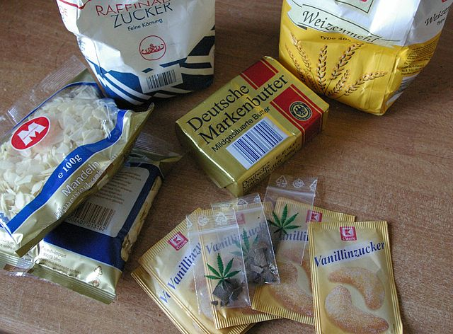

```{r setup, include=FALSE}
options(htmltools.dir.version = FALSE)
knitr::opts_chunk$set(
  fig.width=9, fig.height=3.5, fig.retina=3,
  out.width = "100%",
  cache = FALSE,
  echo = TRUE,
  message = FALSE, 
  warning = FALSE,
  hiline = TRUE
)
```

```{r packages, echo=FALSE}
library(tidyverse)
```

```{r xaringan-extra, echo=FALSE, include=T}
xaringanExtra::use_xaringan_extra(c("tile_view"))
```

```{r palette, echo=FALSE}
# Define palette
pal <- yaml::read_yaml(here::here("inst", "css", "palette.yml"))
```

```{r xaringan-themer, include=FALSE, warning=FALSE}
source(here::here("R", "xaringan-themer.R"))
xaringan_theme(pal=pal)

# additional tweaks - title slide
xaringanthemer::style_extra_css(
  css = list(    
    ".title-slide .license" = list(
      "background-color" = paste0(pal$cultured, "aa"), 
      "border-radius" = ".5rem",
      "padding" = "0.2rem 0.75rem",
      "position" = "absolute",
      "right" = "10px",
      "bottom" = "10px",
      "font-size" = ".65rem"
    )
  )
)

# additional tweaks - about me slide
xaringanthemer::style_extra_css(
  css = list(
    ".about-me-slide .icons a" = list(
      "margin-left" = "0.25rem",
      "margin-right" = "0.25rem",
      "color" = pal$cultured,
      "border-bottom" = glue::glue("1px solid {pal$cultured}")
    ),
    ".about-me-slide img" = list("border" = "#7ae582 solid 4px")
  )
)

# additional tweaks - inverse slides
xaringanthemer::style_extra_css(
  css = list(
    ".inverse hr" = list(
      "background" = css_lg(
        dir = "to right",
        values = list(
          c("turquoise", 33),
          c("light.green", "ff"),
          c("turquoise", 33)
        )
      )
    ),
    ".inverse .remark-slide-number" = list("color" = pal$cultured),
    ".inverse strong" = list("color" = pal$light.green)
  )
)

# additional tweaks - other
xaringanthemer::style_extra_css(
  css = list(
    "code.remark-inline-code" = list(
      "border-radius" = ".25rem",
      "padding" = "1px"
    ),
    "hr" = list(
      "height" = "1px",
      "border-width" = "1px",
      "border-style" = "solid", 
      "border-color" = "transparent",
      "background" = css_lg(
        dir = "to right", 
        values = list(
          c("turquoise", 33), 
          c("queen.blue", "ff"), 
          c("turquoise", 33)
        )
      )
    ),
    ".center > ul" = list(
      "list-style-type" = "none"
    )
  )
)
```

```{r ggplot-theme, echo=FALSE}
# Register fonts
sysfonts::font_add(
  family = "Noto Sans", 
  regular = "/usr/share/fonts/noto/NotoSans-Regular.ttf",
  bold = "/usr/share/fonts/noto/NotoSans-Bold.ttf",
  italic = "/usr/share/fonts/noto/NotoSans-Italic.ttf",
  bolditalic = "/usr/share/fonts/noto/NotoSans-BoldItalic.ttf"
)

# ggplot theme
gg_theme <- function() {
  xaringanthemer::theme_xaringan() +
    theme(
      axis.line = element_line(colour = pal$space.cadet),
      panel.grid = element_line(colour = pal$space.cadet),
      text = element_text(size = 24),
      axis.title = element_text(size = 10)
    )
}


# Set
theme_set(gg_theme())
```

name: title
layout: false
class: title-slide, middle, left

.pull-left[

# `r rmarkdown::metadata$title`

## `r rmarkdown::metadata$subtitle`

**`r rmarkdown::metadata$author`**<br>
`r format.Date(Sys.Date(), "%a, %d %b %Y")`

]

.license[

These slides are available at <>. 

Creative Commons Attribution-NonCommercial-ShareAlike 4.0 International [(CC BY-NC-SA 4.0)](https://github.com/tfzrch/linear-regression-slides/blob/main/LICENSE.md)

Background:

]

```{r xaringan-extra-progress-bar, echo=FALSE}
xaringanExtra::use_progress_bar(pal$light.green, height = "2px")
```

---

name: about-me
layout: false
class: about-me-slide, inverse, middle, center

# About me


## Tom Fowler, PhD

### Data Coach

.icons[

[`r fontawesome::fa("link")` tfzrch.github.io](https://tfzrch.github.io/index.html)
[`r fontawesome::fa("github", a11y = "sem")` @tfzrch](https://github.com/tfzrch)
[`r fontawesome::fa("linkedin", a11y  = "sem")` tfzrch](https://www.linkedin.com/in/tfzrch/)

]

---
class: center, middle

# Machine Learning

???
  Linear regression is a form of machine learning. So let's first define what
  that means. Can anyone describe what they think machine learning is?

---
class: center

## Robots baking cookies


???
  Think about a robot in a baked-goods factory. Because they're a machine they
  don't know what makes a good cookie - they don't know anything about the end
  result of what they're doing.
  
  Instead they're given ingredients and a set of quantities and instructions 
  regarding what to go with them. It's a human supplying this information.
  
  This is traditional programming.

---
class: center

## Robots baking cookies

.pull-left[



]

.pull-right[


]

???
  Machine learning is different. Here, we're creating something that can guess - 
  accurately - at the right output, having worked out for itself what the 
  recipe is.
  
  We give lots examples of inputs and outputs, and the machine calculates what
  the instructions should be to approximate new outputs from new inputs.
  
  **Why might there be recipes out there in world that make sense to write like
  this**?
  
  **Answer:** Some recipes are really complex and would be hard for a human to
  describe with code.

---
class: left, inverse

# Scenario

- You're a data scientist for a cookie manufacturer

--

- There will soon be new taxes on foods with high calories

--

- Your company wants to be ready to put new products with fewer calories into
  production

---

class: left, inverse

# Scenario

- There is a team creating proposals for new recipes
  
--

- They want to test only recipes likely to have calories below the threshold.
  
--

- They need a way to **predict calories from ingredients**.
  
--

- You have **recipes and calorie counts** for old cookies already in production

---

## Cookie Calories

.pull-left[
```{r random-cookies, echo=FALSE, cache=TRUE}
# Generate random data
random_cookies <- tibble(x = rnorm(100), y = x + rnorm(100))
```

```{r plot-random-cookies, echo=FALSE}
# Make plot
plt_random_cookies <- ggplot(random_cookies, aes(x, y)) +
  geom_point(size = 3) +
  labs(
    x = "Ingredients",
    y = "Calories"
  ) +
  theme(
    axis.ticks = element_blank(),
    axis.text = element_blank()
  )
```

```{r show-plt-random-cookies, echo=FALSE, fig.height=7}
# Plot
plt_random_cookies
```
]

.pull-right.left[

- Points - existing cookie recipes

- 'X' - a measure of a single ingredient

- 'Y' - a measure of the calories

]


???
  So 'x' and 'y' are our variables. 'x' is going to be a measure of a single
  ingredient for now, maybe sugar or butter, 'y' is the calories.
  
  Each of the points represents a single cookie recipe that's already in
  production.
  
  **How can we describe these data based on the scatter plot?**
  

---

## Cookie Calories

.pull-left[
```{r, ref.label='show-plt-random-cookies', echo=FALSE, fig.height=7}
```
]

.pull-right.left[

- Positively correlated

- Pearson $r$ - `r round(cor(random_cookies$x, random_cookies$y), digits=2)`

]

---

## Cookie Calories

.pull-left[

```{r plot-random-cookies-lm, echo=FALSE, fig.height=7}
plt_random_cookies +
  geom_smooth(method = "lm", formula = y ~ x, col = pal$vermilion, se = F)
```

]

.pull-right[

- Linear model - the 'recipe' that best describes *all* the cookies

]


---
class: left, inverse

## Recipes

$$y = mx + c$$
--

***

- $y$ = our output - `calories`

--

- $x$ = our input(s) - `ingredients`

```{r cookie-calories-lm, echo=FALSE}
#| cache=TRUE,
#| dependson='random-cookies'

# Get the real model for the plotted random data
lm_cookies <- lm(y ~ x, data = random_cookies)

# Function to generate a single line by predicting from min and max values
get_lm_line <- function(data, model = lm_cookies) {
  
  # Find min and max
  out <- data %>% 
    summarise(across(c(x), .fns = list(min = min, max = max))) %>% 
    pivot_longer(everything(), names_sep = "_", names_to = c("ax", "stat")) %>%
    pivot_wider(id_cols = stat, names_from = ax)
  
  # Add y from predictions
  out$y <- predict(model, newdata = out)
  
  # Return
  out
}

# Generate the best fit line
lm_cookies_line <- get_lm_line(random_cookies)
```

---
class: inverse

### Gradient - $m$

$$y = mx + c$$

***

.pull-left[

- $m$ = slope, gradient
- 'how much change in $y$ for $\pm 1$ change in $x$?'

]

.pull-right[

```{r demo-slope, echo=FALSE}
#| cache=TRUE, 
#| dependson='cookie-calories-lm'

# Generate data to illustrate slope

## - Generate random x coefficients using rnorm around mean of real coefficient
demo_slope_data <- rnorm(n = 20, mean = lm_cookies$coefficients["x"], sd = .35) %>%
  round(digits = 2) %>% 
  sort()

## - Get the real model, and replace real coefficient with generated one
demo_slope_data <- demo_slope_data %>% 
  map(function(x, model = lm_cookies) {
    model$coefficients["x"] <- x
    model
  })

## - Make predictions on min/max values of data using all these dummy models
## - Then give each set and id and collapse into a single data frame
demo_slope_data <- demo_slope_data %>% 
  map(get_lm_line, data = random_cookies) %>% 
  imap_dfr(function(x, n) {x %>% mutate(id = n, .before = 1)})
```

```{r plt-demo-slope, echo=F, fig.height=7}
#| cache = TRUE,
#| dependson='demo-slope'

plt_random_cookies +
  geom_line(
    data = lm_cookies_line, 
    col = pal$vermilion, 
    size = 1,
  ) +
  geom_line(
    data = demo_slope_data, 
    mapping = aes(group = id), 
    col = pal$queen.blue,
    size = 2
  ) +
  gganimate::transition_states(id, wrap = T, state_length = 1)
```

]

---
class: left, inverse

### Intercept - $c$

$$y = mx + c$$

***

.pull-left[

- $c$ = some constant - 
- 'where does the model cross the axis?'
- 'what is $y$ when $x = 0$?'

]

.pull-right[

```{r demo-intercept, echo=FALSE}
#| cache=TRUE, 
#| dependson='cookie-calories-lm'

# Generate data to illustrate intercept

## - Generate random x intercept using rnorm around a mean of real intercept
demo_intercept_data <- rnorm(n = 20, mean = lm_cookies$coefficients["(Intercept)"], sd = .35) %>%
  round(digits = 2) %>% 
  sort()

## - Get the real model, and replace real coefficient with generated one
demo_intercept_data <- demo_intercept_data %>% 
  map(function(x, model = lm_cookies) {
    model$coefficients["(Intercept)"] <- x
    model
  })

## - Make predictions on min/max values of data using all these dummy models
## - Then give each set and id and collapse into a single data frame
demo_intercept_data <- demo_intercept_data %>% 
  map(get_lm_line, data = random_cookies) %>% 
  imap_dfr(function(x, n) {x %>% mutate(id = n, .before = 1)})
```

```{r plt-demo-intercept, echo=F, fig.height=7}
#| cache = TRUE,
#| dependson='demo-intercept'

plt_random_cookies +
  geom_line(
    data = lm_cookies_line, 
    col = pal$vermilion, 
    size = 1
  ) +
  geom_line(
    data = demo_intercept_data, 
    mapping = aes(group = id), 
    col = pal$queen.blue,
    size = 2
  ) +
  gganimate::transition_states(id, wrap = T, state_length = 1)
```


]

---
class: center

### Gradient and Intercept Together

```{r demo-fit, echo=FALSE}
#| cache=TRUE,
#| dependson="cookie-calories-lm"

# Create data for a demo of fit

# Create a df where intercept and x are a vector from rnorm, using the real 
# coefficients from the fitted model as the mean
demo_fit <- lm_cookies$coefficients %>%
  map_dfr(., ~rnorm(30, mean = ., sd = .3)) %>%
  rename(int = 1, x = 2)

# Add an id for each new model, add data from the original data, create a
# version of the lm with the random coefficients
demo_fit <- demo_fit %>% 
  mutate(
    id = 1:30,
    cookies = list(random_cookies),
    lm = map2(int, x, function(int, x, model = lm_cookies) {
      model$coefficients <- c(int, x)
      model
    })) %>%
  # drop the columns containing the generated coefficients
  select(-int, -x)

# Make predictions for the fitted data using the edited models, and get RMSE
demo_fit <- demo_fit %>% 
  mutate(
    cookies = map2(
      .x = lm, 
      .y = cookies, 
      .f = function(model, data) {
        estimate <- predict(model, newdata = data)
        tibble(x = data$x, truth = data$y, estimate = estimate)
      }),
    rmse = map(cookies, yardstick::rmse, truth = truth, estimate = estimate) %>% 
      map_dbl(pull, ".estimate")
  )

# Arrange in descending order by RMSE, then generate the min/max line for each
demo_fit <- demo_fit %>% 
  arrange(desc(rmse)) %>% 
  mutate(line = map(lm, get_lm_line, data = random_cookies))

# Clean up
demo_fit <- demo_fit %>% 
  unnest(line) %>% 
  select(-cookies, -lm)

# Recreate the ids so they match descending RMSE order
demo_fit <- demo_fit %>% 
  group_by(id) %>% 
  nest(data = -id) %>%
  ungroup() %>% 
  mutate(id = 1:30) %>% 
  unnest(data)
```

```{r plt-demo-fit, echo=FALSE, fig.height=4}
#| cache=TRUE,
#| dependson="demo-fit"

plt_demo_fit <- plt_random_cookies +
  geom_line(
    data = lm_cookies_line,
    col = pal$vermilion,
    size = 1
  ) +
  geom_line(
    data = demo_fit, 
    mapping = aes(group = id),
    col = pal$queen.blue, 
    size = 2
  ) +
  gganimate::transition_states(id, wrap = T, state_length = 1) +
  gganimate::ease_aes("sine-in-out")

plt_demo_fit
# gganimate::animate(
#   plot = plt_demo_fit, 
#   fps = 20, 
#   device = "ragg_png",
#   pointsize = 10,
#   scaling = .25
# )
```
